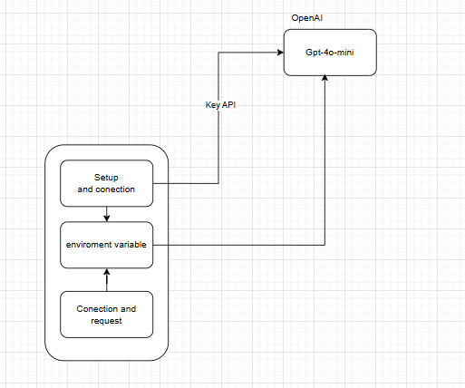
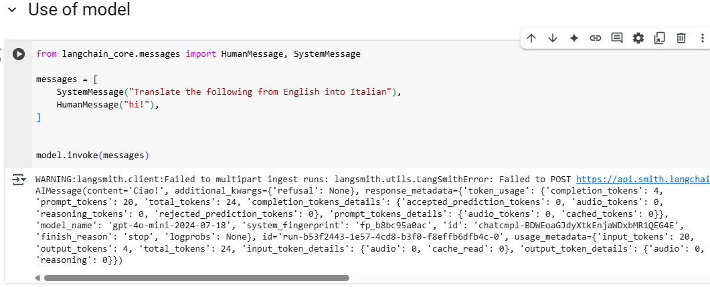

# connect_to_open_ai

This section covers the connection to the OpenAI GPT-4o-mini model.

## What is the project about?

The project is about establishing a connection to the GPT-4o-mini model and running various tests on it to understand its capabilities and performance.

## What needs to be installed?

- Jupyter or, alternatively, Colab.
- **Colab is recommended** as it allows you to install dependencies and run commands without needing to download packages locally. This simplifies the setup process and eliminates potential issues with local installations.

## How do you run the project locally?

To run the project locally:
- You can open the document in Jupyter or Colab.
- Execute each function in order to interact with the model. 
- The functions will guide you through setting up the environment, connecting to the model, and running the tests.

## What architecture does it have?

The architecture involves the following key components:
- **Connection Setup:** Establishing a link to the GPT-4o-mini model.
- **API Integration:** Calling OpenAI’s API to interact with the model.
- **Testing & Output:** Running various tests and handling the responses from the model.

## What is the project structure?

The project is structured into the following sections:
- **Set Up:** Initial setup steps including the installation of necessary libraries.
- **Set Environment Variables:** Defining the required environment variables like API keys.
- **Use Model:** Connecting to the GPT-4o-mini model and running the necessary functions for testing.

## Results of how it looks.

This is an example of the expected output and how the results from the model look after running the tests.

## Author

Yeferson Mesa

## Sources

- [Langchain LLM Chain Tutorial](https://python.langchain.com/docs/tutorials/llm_chain/)
